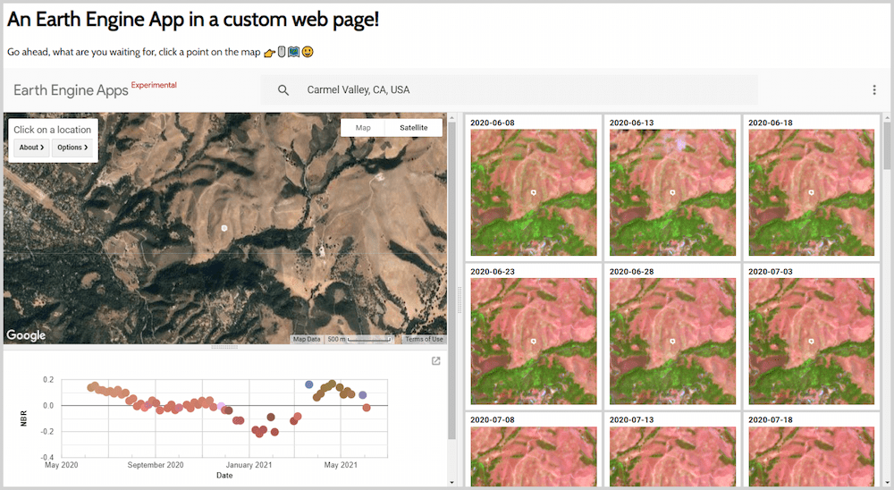

A demonstration of including an [Earth Engine App](https://www.earthengine.app/) in a custom page as an iframe.

- Earth Engine Apps have a default URL and are limited by `ui` module widgets e.g.: 
https://jstnbraaten.users.earthengine.app/view/eo-timeseries-explorer

- But your can embed your app in a customizable page using an iframe e.g.: 
https://jdbcode.github.io/my-sweet-app/

- See this file for iframe usage: 
https://github.com/jdbcode/my-sweet-app/blob/main/index.html

